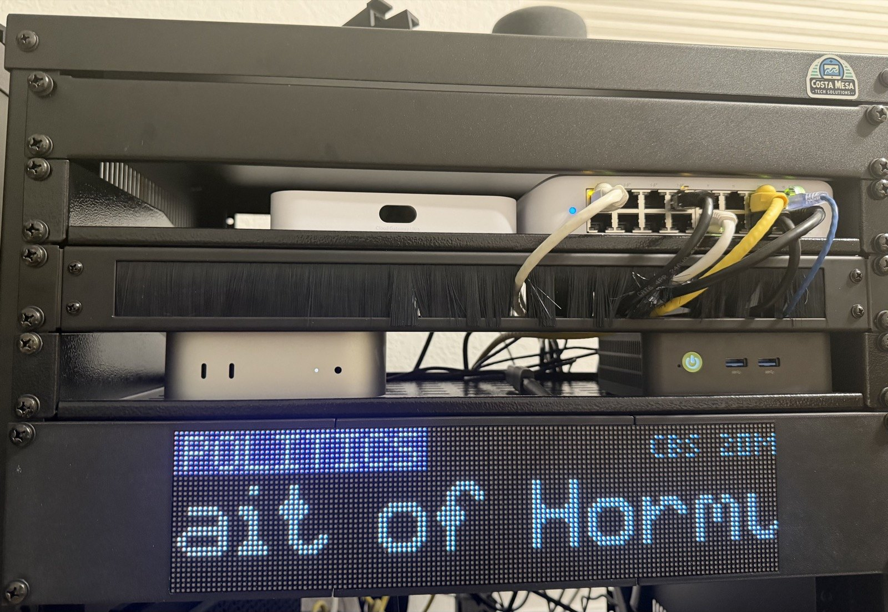
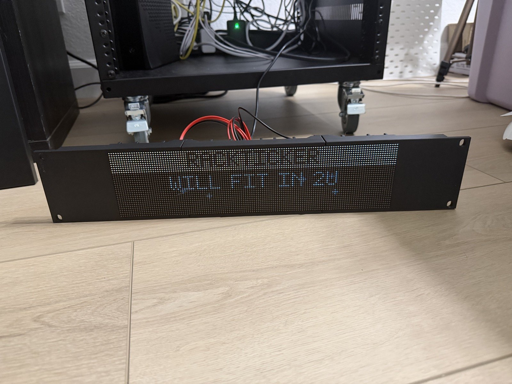
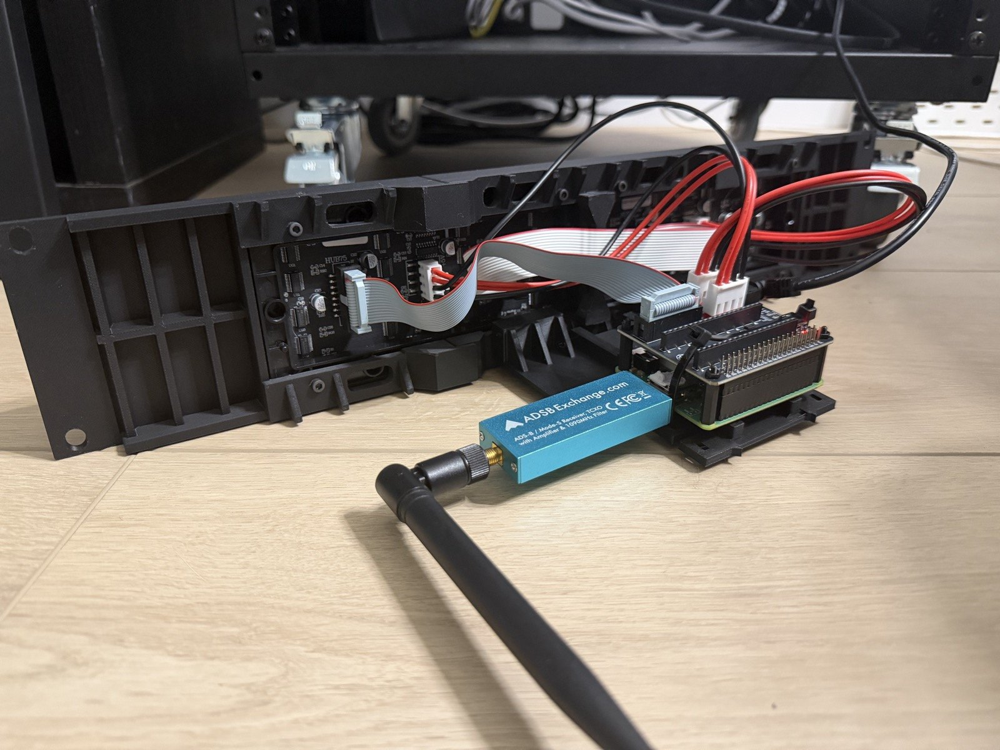

# RackTicker

**Rack enhancement that fits in 2U.**

**By Pine Heights Ventures LLC dba [Costa Mesa Tech Solutions](https://github.com/costamesatechsolutions)**




Live LED signage for your server rack. RackTicker turns two 64×32 RGB LED panels and a
Raspberry Pi into a 128×32 ticker that lives in a 19-inch rack: stock tape, odds boards,
news, flights overhead, weather and a pixel town, with more in the community catalog.
Every screen is a plugin, the bundled data sources are free and need no key, and nothing
needs a cloud account. Run it on your computer first: the browser emulator shows the exact
pixels the panels will.

To write your own screen, fork the
**[plugin starter](https://github.com/costamesatechsolutions/rackticker-plugin-starter)**
or run `python -m app.dev new my_plugin`. See [Make a screen](#make-a-screen).

## Screens

| Screen | What it shows |
| --- | --- |
| Stock tape | The day's movers and your watchlist with company names, sparklines and each company's latest headline, under a flipping index header |
| Sportsbook | A Vegas odds board: spreads, totals and moneylines, big live scores with the bases, count and outs or the down and distance, banners for big plays, fireworks when your team scores |
| News desk | Network channels as a TV lower third or a Times Square zipper, in mixed-case headlines |
| Flights | The planes overhead: airline mark, flight number and route, then destination, aircraft, altitude and time to go; a list when several are about, a fly-by when one is directly overhead. Local ADS-B receiver or a free network feed |
| Weather | Animated sky, hourly chart and four-day forecast |
| Pixel Town | A small town on real time in three districts: a beach with the real tide and swell, a high street with a taco truck and your weather, and a station with real departures. The panel is a camera that drifts between them. The beach and station use the Surf and Departures plugins when installed |
| Clocks | Desk clock (with a 4:20 surprise) and TIX Clock |

**[Community plugins](https://github.com/costamesatechsolutions/rackticker-community-plugins)** live in their own repository and install from the
Plugins page with one click:

| Plugin | What it shows |
| --- | --- |
| [Departures](https://github.com/costamesatechsolutions/rackticker-community-plugins/tree/main/plugins/departures) | Live station boards: the London Underground in its own line colours, Metrolink and Amtrak across the United States, BART, and Budapest-Keleti, Roma Termini, Milan, Florence, Venice, Naples and Zürich, each in its country's style, with real delays, platforms, station announcements, and trains pulling in |
| [Onboard](https://github.com/costamesatechsolutions/rackticker-community-plugins/tree/main/plugins/onboard) | The strip map above the carriage doors of a train that is really running: the line, its stops, the train sliding along it, the next stop and how long until it |
| [Tanks](https://github.com/costamesatechsolutions/rackticker-community-plugins/tree/main/plugins/tanks) | California's reservoirs, and the space station's urine and water tanks, as sloshing water |
| [Quakes](https://github.com/costamesatechsolutions/rackticker-community-plugins/tree/main/plugins/quakes) | Earthquakes around you from the USGS on a 24-hour seismograph |
| [Surf](https://github.com/costamesatechsolutions/rackticker-community-plugins/tree/main/plugins/surf) | Wave height, swell, water temperature and the tide at your break: the sea sits high or low with the real tide, with the next turn and which way it is going |
| [Now playing](https://github.com/costamesatechsolutions/rackticker-community-plugins/tree/main/plugins/now_playing) | The song you're listening to like an old car stereo: album art, scrolling title, track and time, spectrum analyser. Spotify or Home Assistant |
| [Virtual Aquarium](https://github.com/costamesatechsolutions/rackticker-community-plugins/tree/main/plugins/virtual_aquarium) | A tank of clownfish, angelfish and neon tetras, with swaying plants and a wandering snail |
| [Retro Screensavers](https://github.com/costamesatechsolutions/rackticker-community-plugins/tree/main/plugins/retro_savers) | 3D pipes, Mystify, a starfield, a bouncing badge and marquee text |
| [Arcade](https://github.com/costamesatechsolutions/rackticker-community-plugins/tree/main/plugins/arcade) | Pixel Quest, Tetris, Snake, Breakout, Invaders and Pong, played live by AIs |
| [Formula 1](https://github.com/costamesatechsolutions/rackticker-community-plugins/tree/main/plugins/f1) | A start-light gantry counting down to lights out, the last race's podium and the championship fight |
| [Prediction markets](https://github.com/costamesatechsolutions/rackticker-community-plugins/tree/main/plugins/markets) | Polymarket and Kalshi: each question whole and still, then its odds slide up |
| [LED sign](https://github.com/costamesatechsolutions/rackticker-community-plugins/tree/main/plugins/ticker_wall) | Your own words on a storefront sign: letters that assemble, drop and spin, in taqueria, Vegas, arena and Times Square styles |
| [Freeway traffic](https://github.com/costamesatechsolutions/rackticker-community-plugins/tree/main/plugins/traffic) | California freeways near you: CHP incidents, the real overhead message signs, and travel-time signs as they read over the road |
| [Data from a link](https://github.com/costamesatechsolutions/rackticker-community-plugins/tree/main/plugins/url_data) | Any value from a JSON address as a big card, no code |

Screens finish the headline, card or lap they are showing before the playlist moves
on, skip themselves when they have nothing to show, and move on a frame-locked clock
so crawls step exactly one LED per frame.

## What you need

| Part | Notes |
| --- | --- |
| **Raspberry Pi 3A+** | The reference build. A Pi Zero 2 W should work (untested); the original Zero W is too slow |
| **2 × Waveshare 64×32 P2.5 RGB LED matrix panels** | HUB75, chained side by side: 320 × 80 mm of screen |
| **WatangTech RGB Matrix Adapter Board** | Sits on the Pi's header and drives the panels ("regular" pin mapping) |
| **5 V power supply with a barrel plug** | 4 A or more; 8 A leaves headroom at full brightness. Match the adapter's jack |
| **microSD card** | 16 GB or more, Raspberry Pi OS Lite |
| **3D printed 2U rack face** | Four parts and eight M3 × 10 screws; 88 mm of rack height. **[Print files on MakerWorld](https://makerworld.com/en/models/3327605-rackticker-2u-led-ticker-for-your-server-rack)**; guide in [BEZEL_V10.md](hardware/enclosure/BEZEL_V10.md) |
| **USB ADS-B receiver** *(optional)* | An RTL-SDR stick and antenna for planes overhead; without one, Flights uses a free network feed |

The panel frame is always exactly 128×32 RGB. Typography, clipping and motion are
designed at that size, so what the emulator shows is what the panels show.

| The 2U face | Behind it |
| --- | --- |
|  |  |

Two panels, the adapter board on the Pi's header, one barrel jack for power, and
an ADS-B stick if you want the planes overhead to be the ones actually overhead.

## Try it on your computer

Python 3.10 or newer:

```sh
python3 -m venv .venv
source .venv/bin/activate
python -m pip install -r requirements.txt
python -m app
```

Open **http://localhost:8080/**. On your own computer the control page is on port
**8080**. (Installed on a Pi it is on **8081**; see below.) The first run starts a
playlist of real screens and asks where the rack is.

Windows PowerShell:

```powershell
py -3.12 -m venv .venv
.venv\Scripts\python.exe -m pip install -r requirements.txt
.venv\Scripts\python.exe -m app
```

`python -m app --help` lists options (`--port`, `--config`, `--host 0.0.0.0` to
open it to your LAN, `--output hub75` on a Pi).

## Install on a Pi

1. With [Raspberry Pi Imager](https://www.raspberrypi.com/software/), flash **Raspberry Pi
   OS Lite (64-bit)**. Under Edit Settings, set a hostname (for example `rackticker`),
   a user and password, your Wi-Fi, and enable SSH.
2. Boot it, SSH in once, and run:

   ```sh
   curl -fsSL https://raw.githubusercontent.com/costamesatechsolutions/rackticker/main/tools/install.sh | sudo bash
   ```

   It builds the panel driver, reboots, and installs the newest release by itself
   (about ten minutes on a Pi 3A+).

3. **Open the control page at `http://<your-pi>:8081/`** (port 8081, not 8080). The panels
   show the address when they light up, by name and by IP: `rackticker.local:8081` or
   `192.168.1.50:8081`. The name is the hostname you set in the imager. If `.local` does not
   resolve (some Windows and Android setups), use the IP.

That is the last time you need SSH:

- **Updates:** Settings → Software shows when a new version is out; press Update.
  The new version is installed beside the running one, and if it does not come up
  healthy within a minute RackTicker switches back to the old one by itself.
- **Self-healing:** every day, and at boot, RackTicker checks its installed files
  against fingerprints taken at install and repairs anything damaged, from the
  previous version or a fresh download.
- **Wi-Fi setup mode:** with no Wi-Fi saved, or after five minutes without the
  saved one (new router, new password, moved house), the panel shows
  **Wi-Fi setup**: join the `RackTicker-Setup` network with your phone, pick your
  Wi-Fi on the page that opens, and it reconnects. If the old network comes back,
  it rejoins by itself. A working connection is never touched.
- **Reset:** Settings → Software, as far back as you like. *Settings and plugins*
  keeps a backup of your old settings and leaves Wi-Fi alone; *Wi-Fi only* forgets
  the network and opens setup mode, for when RackTicker moves house without you;
  *Everything* clears settings, plugins, the password and Wi-Fi; *Ready to pass on*
  does all of that and then some (see below).
- **Password:** optional, in Settings → Software. Forgot it? Unplug RackTicker as soon
  as its panel lights up, three times in a row; on the next start the panel says
  PASSWORD CLEARED. No computer needed.
- **Crash protection:** if RackTicker keeps stopping, it goes back to the previous version.

### Passing one on, or cloning cards

**Settings → Software → Reset → Ready to pass on** hands a unit over clean. It clears
settings, installed plugins, plugin logins, the control page password and the saved Wi-Fi,
wipes the system log and shell history, and clears the device's own identity (machine id,
ssh host keys and name). Then it powers off; wait for the panel to go dark before
unplugging.

Cards cloned from one image without that step share a machine id, ssh host keys and
`.local` name, so the Pis clash on a network. After *Ready to pass on*, each card's first
boot makes its own and names itself from its Pi's serial number (for example
`rackticker-3c4d`). The panel shows the name and address it settled on.

To make a master card: set one up, reset it *Ready to pass on*, then image the card once
it has powered off.

**Developing from a computer:** `RACKTICKER_PI_HOST=pi@rackticker.local ./tools/deploy_pi.sh`
installs your committed working copy the same way, with the same health check and rollback.

## Panel tuning

The companion accepts every standard `rpi-rgb-led-matrix` `--led-*` flag from
`/etc/rackticker/matrix.conf` (installed once, never overwritten by updates);
restart it with `sudo systemctl restart rackticker-matrix` after editing.

- **Flicker:** the default `--led-limit-refresh=120` holds one steady refresh rate.
  Unlimited, the reference build swung from 208 Hz down to 93 Hz whenever the Pi was
  busy decoding ADS-B, which shows as bursts of flicker. Measure your panel with
  `--led-show-refresh` and keep the limit below its lowest rate.
- **Colours:** press **Settings → Developer tools → Colour test** and check each block matches its label. If
  GREEN shows blue (and amber looks pink), your panels are wired RBG: add
  `--led-rgb-sequence=RBG`.
- **Dim colours:** `--led-pwm-lsb-nanoseconds=160` (the default here) keeps very low
  brightness from drifting pink.
- **Other hardware:** for example an Adafruit bonnet:
  `--led-gpio-mapping=adafruit-hat --led-rows=32 --led-cols=64 --led-chain=2`.

## The control page

- **Now**: the live panel, what is playing, Pause and Next, a tile per screen to
  put it up now, panel on/off, brightness and a quick message.
- **Screens**: the playlist. Switch screens on and off, set their seconds, reorder,
  and open any screen's settings: team pickers by name, league chips, city search.
- **Plugins**: switch plugins on and off, install from a GitHub link or the
  community list, update, restart, remove.
- **Settings**: home location, brightness and night dimming, transitions, Home
  Assistant, and developer tools.

The page is open by default and binds to `127.0.0.1` unless you pass `--host` (the Pi
install passes it, so the page is on your network). Set a password under
Settings → Software if you want one. Everything the page does is also a small JSON
API under `/api/`.

## Home Assistant and voice

Settings → Home Assistant connects RackTicker to an MQTT broker (the Mosquitto
add-on works). It appears in Home Assistant as a device by itself: a light for on/off
and brightness, a Screen picker, a **Show …** switch for every screen, Next and a
Message box. Expose those switches to Alexa or Google through Home Assistant (or its
Matter bridge) and say "turn on Show Sportsbook".

## Make a screen

A plugin is a folder with a `plugin.json` and a Python file; you never edit RackTicker
itself. Fork the
**[plugin starter](https://github.com/costamesatechsolutions/rackticker-plugin-starter)**
or scaffold your own:

```sh
python -m app.dev new surf_report           # a working starting point
python -m app.dev check surf_report         # renders preview.png / preview.gif and reports problems
python -m app.dev preview surf_report       # live in the browser, reloads on save
python -m app.dev push surf_report --to rackticker.local:8081
```

Share it as a folder in a public GitHub repository: anyone installs it by pasting the link
into **Plugins → Add a plugin**, and updates it with one click. Installed plugins run in
their own sandboxed process, so a crash or hang restarts only that plugin and the display
never waits for it. The scaffold includes an `AGENTS.md` with the panel's rules, so an AI
coding agent can build and check a screen on its own. To list yours for everyone, open a
pull request against the
**[community plugins repository](https://github.com/costamesatechsolutions/rackticker-community-plugins)**
with one folder and one catalog entry. Full guide: [docs/plugins.md](docs/plugins.md).

## How it stays smooth

Animation time is counted in integer units, so a 30 px/s crawl at 30 fps moves one
LED every frame for weeks. Data providers run on their own thread and hand feed
parsing to a helper process, so a 1 MB market feed never freezes a frame; installed
plugins run in their own processes entirely. Frames slower than 25 ms and loop
stalls are recorded under `perf` in `/api/state`. Details:
[docs/architecture.md](docs/architecture.md).

Rendering runs as an unprivileged service. A small root-owned C++ companion alone owns the
GPIO and takes frames over a local socket, and the updater and network keeper are separate
root services the web page can only ask.

## Develop

```sh
python -m unittest discover -s tests -t .
python -m tools.render_demo          # regenerate docs/demo.gif from live data
```

See [CONTRIBUTING.md](CONTRIBUTING.md) and [AGENTS.md](AGENTS.md).

## License

AGPL-3.0-only. Copyright (c) 2026 RackTicker contributors. The original fonts and
assets are covered by the same license; dependencies keep their own. The control
page links to the license and a source archive of the running core. See
[LICENSE](LICENSE) and the [plugin licensing notes](docs/plugins.md#licensing-and-source).

The printable enclosure (`hardware/`) is licensed separately under
[CC BY-NC-SA 4.0](https://creativecommons.org/licenses/by-nc-sa/4.0/): print it, remix it,
share it, but don't sell it.
