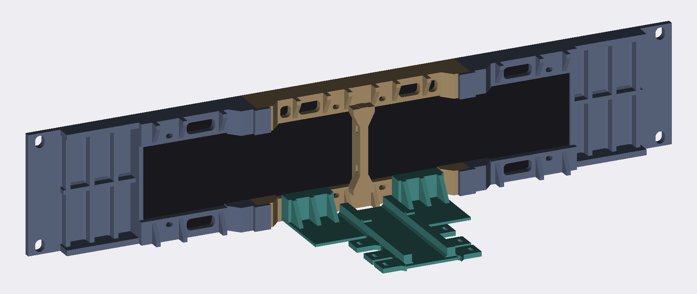

# RackTicker 2U bezel — V10 (release)

A 19-inch, 2U rack face for two 64×32 P2.5 HUB75 LED panels, driven by a
Raspberry Pi 3A+ with an RGB matrix adapter board. The front is solid black except for the
screen, and it's built from 4 printed parts, 8 screws and 4 rack screws.




---

## What you need

| | Qty | Notes |
|---|---:|---|
| Waveshare RGB-Matrix-P2.5-64×32 panel | 2 | Comes with its ribbon and power leads |
| Raspberry Pi 3A+ | 1 | A Pi Zero 2 W should work too (untested) |
| WatangTech RGB Matrix Adapter Board | 1 | The HUB75 adapter ("regular" pin mapping) |
| microSD card, 16 GB or more | 1 | Raspberry Pi OS Lite |
| 5 V power supply, barrel plug | 1 | 5 V, sized for your panels (4 A or more is a good start). Match the adapter's jack (usually 5.5 × 2.1 mm) |
| **M3 × 10 screw, socket cap or pan head** | **8** | **not countersunk**; buy a 10- or 25-pack |
| rack screws | 4 | whatever your rack takes; corners only |
| zip tie, 2.5–4.8 mm | 1–3 | holds the Pi on the cradle; one in the middle is enough |
| matte PLA | ≈ 220 g | PETG works too |

**Nothing threads into plastic.** All 8 screws go into the brass inserts in the
panels. The printed parts hold each other with jigsaw keys and dovetails.

---

## Print

Each file is already oriented and centred. **Open, slice, print. Don't
rotate, and don't use auto-orient.**

| File | Print | Supports | Brim |
|---|---:|---|---|
| `v10/3mf/rackticker-face-end-v10b.3mf` | **×2** | build plate only | 5 mm outer |
| `v10/3mf/rackticker-face-centre-v10.3mf` | ×1 | build plate only | 5 mm outer |
| `v10/3mf/rackticker-pi-cradle-v10.3mf` | ×1 | **OFF** | none |

> **The cradle must print with supports OFF.** Its two dovetail slots open onto
> the bed, and "build plate only" supports would fill them solid. The slot
> roofs are short bridges that PLA prints fine without support.

0.20 mm layers · 5 walls · 6 top/bottom · 30 % gyroid · elephant-foot
compensation on (default) · seam at rear.

`face-end-v10b` replaces the first V10 end part: its joint node is raised
to meet the cap, so the top is one flat surface instead of having a 3 mm step.
Nothing the centre part touches changed, so `face-centre-v10` and
`pi-cradle-v10` are unchanged and fit either end part.

The two face-end prints are identical. One goes on the left and one on the
right, installed upside down relative to each other. The part is symmetric top
to bottom, so it fits either way.

After printing, snap the supports off the rear plates and push an M3 screw
through every slot to be sure none is blocked.

---

## Assemble

Lay both panels **face down** on a towel, butted together at the seam.

1. **face-centre** goes on first, straddling the seam. Fit its 4 screws loosely.
2. **face-end ×2**: lower each one straight down so its two jigsaw keys drop into
   the sockets in the centre part. Fit 2 screws each, loosely.
3. Push the panels together so the seam is closed, check the black gap around
   the screen looks even, then **tighten all 8 screws by hand**. Each screw has
   exactly 5 mm of thread in the panel, so don't power-drive them.
4. **Pi**: drop the Pi 3A+/HAT into the cradle with **USB toward the open rear**.
   The micro-SD and the HAT's DC jack then face the panels, and the cradle
   leaves 38 mm of room there. Put one zip tie through the middle pair of
   slots, over the HAT.
5. **Cradle**: hold it above its two rails on the centre part and slide it
   straight down until it stops. It hangs by gravity, so no screw is needed.
6. Route the panel power leads through the two tie slots in the centre fin.
7. Lift into the rack and fit the 4 corner rack screws.

**Service:** the Pi sits in front of the two lower centre screws. Lift the
cradle off its rails by hand to reach them.

---

## What was verified

`validate_bezel_v10.py` runs **94 checks, all passing**, against the exported
files the slicer gets, not the CAD model. Full table:
[`v10/VALIDATION_V10.md`](v10/VALIDATION_V10.md).

- every printed part is exactly **one connected solid**, watertight, and fits
  the A1 Mini bed
- **0.0000 mm³** of plastic inside either LED panel's space
- **exactly 5.000 mm** of material at all 8 screws, and every screw path open
- **nothing touches the panel back** where the connectors are
- **0 open points** outside the screen opening, a 0.40 mm gap around the
  screen, and the rack interior fully hidden
- the Pi + HAT stack fits, with the Pi's power side, the HAT's jack side, the
  USB end and the micro-SD end all clear
- **jigsaw keys** fully engaged, with at most 0.25 mm of play and 4.75 mm walls
- **no section thinner than 3.0 mm** (about 7 printed lines), checked on every
  0.6 mm slice of every part
- **the assembly moves themselves**: the cradle slides onto its rails and each
  end part drops onto its keys, checked in 0.5 mm steps with zero collision
- a **hex key reaches all 8 screws** in a straight line (the two lower
  centre ones once the cradle is lifted off)
- **all 8 installed screw heads clear the cradle**, both hung in place and
  along its whole slide-down path
- no floating islands in any sliced layer

**Hand strength calculations, matte PLA** (in-layer 35 MPa, across layers 12 MPa):

| Load | Safety factor |
|---|---:|
| 50 N push on the middle of the screen, bezel only (panels ignored) | 4.1 |
| that push pulling on a jigsaw key | 17.2 |
| 20 N pressing on the Pi while plugging in, 103 mm lever | 3.6 |
| cradle rail neck, loaded across layers | 48 |
| zip tie pulled hard | 5.0 |

---

## Source

Everything is parametric. One number changes one feature.

- `rackticker_v10_params.py`: every dimension, each with the reason for it
- `build_bezel_v10.py`: the CadQuery model, STEP, STL and 3MF export
- `validate_bezel_v10.py`: the 94 checks

```bash
python build_bezel_v10.py && python validate_bezel_v10.py
```

This needs the CAD environment in `requirements-cad.txt`.

Common tweaks:

| Want | Change |
|---|---|
| LEDs further back or forward | `LED_PROUD` |
| a looser or tighter screen gap | `AP_CLR` |
| a looser jigsaw fit | `KEY_CLR` |
| a looser cradle on its rails | `DOVETAIL_CLR` (sides and depth) |
