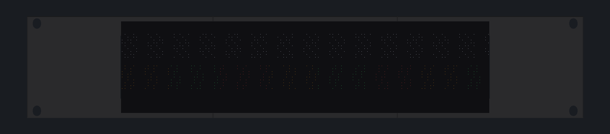

# RackTicker 2U enclosure

**[Print files on MakerWorld](https://makerworld.com/en/models/3327605-rackticker-2u-led-ticker-for-your-server-rack)** · **[BEZEL_V10.md](BEZEL_V10.md)** is the release: what to buy, how to print, how to
assemble. Four printed parts (face end ×2, face centre, Pi cradle), eight M3 × 10
screws and four rack screws turn two 64×32 P2.5 panels into a 19-inch, 2U rack face.



| Folder | What |
| --- | --- |
| `v10/3mf/` | Print files, oriented and ready to slice (Bambu Studio and others) |
| `v10/stl/` | The same parts as STL |
| `v10/step/` | STEP for editing in Fusion, FreeCAD or Onshape |
| `v10/assembly-stl/` | The parts placed as assembled, for a quick look |
| `v10/render/` | The renders above |

The parts are generated from source. To change a dimension, edit
`rackticker_v10_params.py` and rebuild (CadQuery runs in its own environment):

```sh
python3 -m venv cadenv && ./cadenv/bin/pip install -r hardware/enclosure/requirements-cad.txt
./cadenv/bin/python hardware/enclosure/build_bezel_v10.py
./cadenv/bin/python hardware/enclosure/validate_bezel_v10.py   # 94 checks: fit, walls, loads
```

`MEASUREMENTS.md` records the measured panel and rack dimensions the design is
built on; `v10/VALIDATION_V10.md` is the latest validation report.
